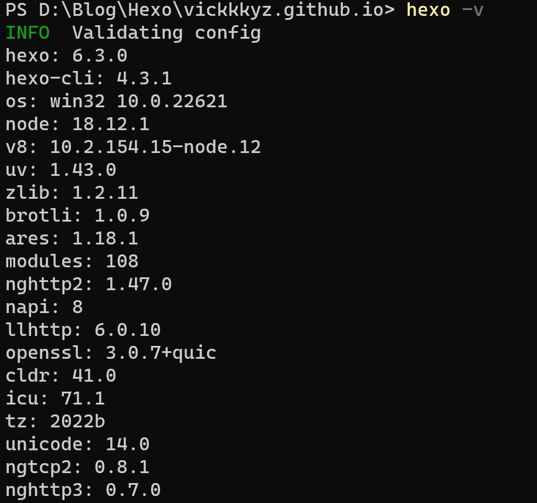

# 前言

最近一直在思考，我该怎么学习。自从工作以来，我仿佛丧失了思考和学习能力，平时使用的又是"行业毒瘤"低代码来工作，感觉自己越来越焦虑，胆怯，那我以后还可以干什么？今天dk学长找我，问我忙不忙，要不要加入一个新项目开发，因为已经很久没有写过代码，担心自己完不成任务。后来认真想了一下，还是要找到一个喜欢的方式来学习。

曾经尝试过各种方法，包括纯本地markdown，思维导图，notion，Obsidian，语雀，博客，等等吧，都有用过一段时间，但是没有一个是一直坚持的。博客（这里指搭建在服务器上的）对我的打击最大(。_。)，大学很长一段时间在更博客，2年后，服务器要过期了，没有继续续费，我的笔记上的图片有一部分本地没有备份，等我想起来的时候服务器资源已经释放了。


目前认为是使用本地+GitHub最好，内容既掌握在自己手里，又可以发布到网络上，很有成就感呢！

# GitHub+Hexo搭建博客

## GitHub配置

1. 创建一个仓库，名字必须为xxx.github.io
2. settings中添加本地生成的公钥id_rsa.pub

## Hexo和Fluid主题配置

### Hexo

1. **安装node.js**

2. **下载Hexo**

   ```bash
   npm install hexo-cli -g
   hexo init ***.github.io #初始化本地博客文件夹
   cd ***.github.io
   npm install
   hexo server # localhost:4000 打开本地服务器预览
   ```

   ```bash
   hexo -v # 查看hexo安装版本 
   ```

   hexo版本为6.3.0，hexo-cli版本为4.3.1

   

### Fluid主题

#### 安装Fluid

```bash
npm install --save hexo-theme-fluid
```

然后在本地博客目录下创建[_config.fluid.yml](https://github.com/fluid-dev/hexo-theme-fluid/blob/master/_config.yml)文件夹，并把其中内容复制进去。

#### 配置Fluid

1. 参考[Fluid用户指南](https://hexo.fluid-dev.com/docs/guide/#%E5%85%B3%E4%BA%8E%E6%8C%87%E5%8D%97)，修改博客目录中的 _config.yml，修改两个字段：

   ```bash
   language: zh-CN  # 指定中文
   theme: fluid  # 指定主题
   ```

2. 修改博客根目录下的_config.yml文件中的deploy

   ```bash
   deploy:
     type: git
     repo: git@github.com:xxx/xxx.github.io.git
     branch: master # 这是自己创建的分支,自己起的名字
   ```

3. 安装hexo-deployer-git自动部署发布工具，将hexo 部署到 git page 的 deployer

   ```bash
   npm install hexo-deployer-git --save
   hexo d  # hexo deploy，如果本地服务器没问题就可以上传到github上
   ```

4. 更新博客之后，通过如下命令上传github

   ```bash
   $ hexo clean    # 清空一下缓存，有时候博客页面显示不正常也可以试试这个命令行
   $ hexo g    # 是hexo generate，把刚刚做的改动生成更新一下
   $ hexo s   # hexo server，判断本地服务器效果https://localhost:4000
   $ hexo d    # hexo deploy，如果本地服务器看了没问题就可以上传到github网站
   ```