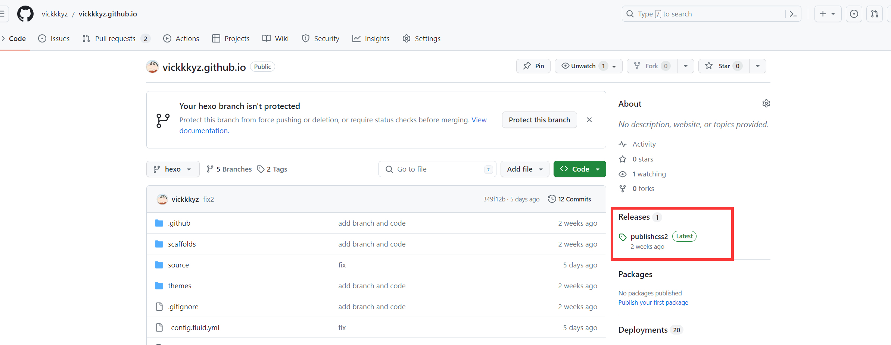
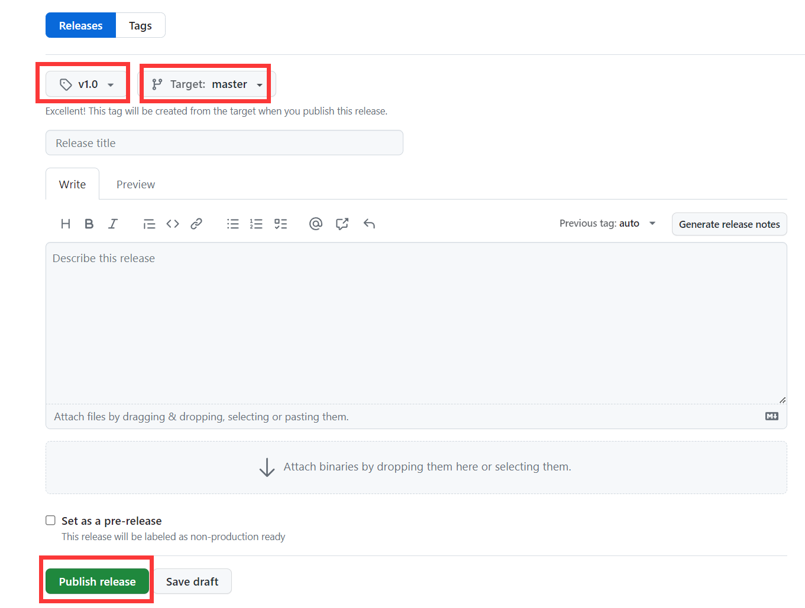



本文按照时间顺序，记录博客的装修进程，着重记录踩坑和经验，希望能给和我遇到一样问题的小伙伴一些参考。



# 2024.1.7(1) 恶搞浏览器网页标题

在`根目录/node_modules/hexo-theme-fluid/source/js`这里！创建一个名为FunnyTitle.js的文件，内容如下：

```js
var OriginTitle = document.title;
var titleTime;
document.addEventListener('visibilitychange', function () {
    if (document.hidden) {
        $('[rel="icon"]').attr('href', "/image/beautify/xinsuixuanzhong.png");
        document.title = '_(:з」∠)_不要走！';
        clearTimeout(titleTime);
    }
    else {
        $('[rel="icon"]').attr('href', "/image/beautify/favicon.ico");
        //document.title = '(*/ω＼*)你来啦' + OriginTitle;
        document.title = '(*/ω＼*)你来啦~~';
        titleTime = setTimeout(function () {
            document.title = OriginTitle;
        }, 2000);
    }
});
```

然后在`根目录/node_modules/hexo-theme-fluid/layout/layout.ejs`中引用上面的文件，具体写法：

```ejs
<!--写在body标签内-->
<!--浏览器搞笑标题-->
<script type="text/javascript" src="\js\FunnyTitle.js"></script>
```

参考：[知乎](https://zhuanlan.zhihu.com/p/69211731)

# 2024.1.7(2) 给网站添加「霞鹜文楷」字体

1. 修改这个文件`根目录/node_modules/hexo-theme-fluid/layout/_partials/head.ejs`

   在`< head >`标签内添加这段代码：

   ```ejs
   <!-- 通过cdn引入霞鹭文楷字体 -->
   <link rel="stylesheet" href="https://npm.elemecdn.com/lxgw-wenkai-screen-webfont/style.css" media="print" onload="this.media='all'">
   ```

2. 在`根目录/node_modules/hexo-theme-fluid/source/css`下面添加文件`custom.css`

   ```css
   html,
   body,
   .markdown-body,
   p {
       font-family: 'LXGW WenKai Screen';
   }
   ```

3. 在`_config.fluid.html`的`font`标签的`font_family`字段添加`"LXGW Wenkai Screen"`

   ```yml
   font:
     font_size: 16px
     font_family: "LXGW Wenkai Screen"
     letter_spacing: 0.02em
     code_font_size: 85%
   ```

参考：[彭宏豪](https://penghh.fun/2023/05/07/2023-5-7-hexo_blog_font/)

# 2024.1.7(3) 背景固定+毛玻璃效果


背景固定


博客根目录新建一个文件夹`scripts`，在里面新建一个文件`injector.js`，内容为：

```js
const { root: siteRoot = "/" } = hexo.config;
hexo.extend.injector.register("body_begin", `<div id="web_bg"></div>`);
hexo.extend.injector.register("body_end", `<script src="${siteRoot}js/backgroundize.js"></script>`);
```

在`node_modules/hexo-theme-fluid/source/js`下新建文件`backgroundize.js`，内容为：

```js
document
    .querySelector('#web_bg')
    .setAttribute('style', `background-image: ${document.querySelector('.banner').style.background.split(' ')[0]};position: fixed;width: 100%;height: 100%;z-index: -1;background-size: cover;`);

document
    .querySelector("#banner")
    .setAttribute('style', 'background-image: url()')

document
    .querySelector("#banner .mask")
    .setAttribute('style', 'background-color:rgba(0,0,0,0)')
```


毛玻璃


`_config.fluid.yml`中修改文章背景色为透明：

```yml
# 主面板背景色
# Color of main board
board_color: "#ffffff80"
board_color_dark: "#00000080"
```

在`node_modules/hexo-theme-fluid/source/css`中新建文件`cloudedGlass.css`

```css
#board {
  -webkit-backdrop-filter: blur(5px);
  backdrop-filter: blur(5px);
}
```

`_config.fluid.yml`引入

```yml
custom_css: 
  - /css/cloudedGlass.css
```

参考：[清山的博客](https://qingshaner.com/Hexo%20Fluid%E4%B8%BB%E9%A2%98%E8%83%8C%E6%99%AF%E5%9B%BA%E5%AE%9A(ES6%E6%94%B9%E5%86%99%E7%89%88)%E4%B8%8E%E6%AF%9B%E7%8E%BB%E7%92%83%E5%BA%95%E9%A1%B5/)

# 2024.1.7(4) 修改行内代码颜色

修改这个文件：`博客根目录/node_modules/hexo-theme-fluid/source/css/_ pages/_base/base.styl`，找到code这一行，修改color的值。

```styl
code
  //color inherit
  color #E05B35
```

参考：[简书](https://www.jianshu.com/p/ba692a97a602)

# 2024.1.6(1) 页脚添加网站运行时间

需要修改主题的源代码，在网上搜索了很多类似的，都要改`themes/source`下面的文件，但是我的themes文件夹下面是空的！搜索了几篇文章，发现其实有两种方式可以加载fluid主题。

**方式一：**（我采用的是这种方式）

Hexo 5.0.0 版本以上，推荐通过 npm 直接安装，进入博客目录执行命令：

```sh
npm install --save hexo-theme-fluid
```

然后在博客目录下创建 `_config.fluid.yml`，将主题的 [config.yml](https://github.com/fluid-dev/hexo-theme-fluid/blob/master/config.yml) 内容复制进去。

**方式二**：（网上大部分采用的这个方法，所以themes下面有内容）

下载 [最新 release 版本](https://github.com/fluid-dev/hexo-theme-fluid/releases) 解压到 Hexo 博客目录中的 `themes` 目录，并将解压出的文件夹重命名为 fluid。

参考：https://emoryhuang.cn/blog/1729600336.html

---

**所以方式一该怎么修改源代码呢？**

我们并不是在`themes`文件，而是npm帮我们管理的，位置在`博客根目录/node_modules/hexo-theme-fluid/source`

所以！就直接在这里改。

在`node_modules/hexo-theme-fluid/source/js`下新增文件`duration.js`，内容如下：

```js
var now = new Date();
function createtime() {
    var grt = new Date("12/24/2023 22:51:00");//在此处修改你的建站时间，格式：月/日/年 时:分:秒
    now.setTime(now.getTime() + 250);
    days = (now - grt) / 1000 / 60 / 60 / 24; dnum = Math.floor(days);
    hours = (now - grt) / 1000 / 60 / 60 - (24 * dnum); hnum = Math.floor(hours);
    if (String(hnum).length == 1) { hnum = "0" + hnum; } minutes = (now - grt) / 1000 / 60 - (24 * 60 * dnum) - (60 * hnum);
    mnum = Math.floor(minutes); if (String(mnum).length == 1) { mnum = "0" + mnum; }
    seconds = (now - grt) / 1000 - (24 * 60 * 60 * dnum) - (60 * 60 * hnum) - (60 * mnum);
    snum = Math.round(seconds); if (String(snum).length == 1) { snum = "0" + snum; }
    document.getElementById("timeDate").innerHTML = "本站已安全运行 " + dnum + " 天 ";
    document.getElementById("times").innerHTML = hnum + " 小时 " + mnum + " 分 " + snum + " 秒";
}
setInterval("createtime()", 250);
```

然后在`_config.fluid.yml`的`footer`标签中添加：

```yml
<!-- 页脚添加网站运行时间 -->
<div>
    <span id="timeDate">载入天数...</span>
    <span id="times">载入时分秒...</span>
    <script src="/js/duration.js"></script>
</div>
```

参考：https://www.liujunxiang0076.asia/2023/08/03/hexo%E6%B7%BB%E5%8A%A0%E7%BD%91%E7%AB%99%E8%BF%90%E8%A1%8C%E6%97%B6%E9%97%B4/

# 2024.1.6(2) 美化的标签语法

```markdown

default 提示块标签


  //可使用语法 no-icon去掉小图标
primary 提示块标签



success 提示块标签



info 提示块标签



warning 提示块标签



danger 提示块标签

```


default 提示块标签


  //可使用语法 no-icon去掉小图标
primary 提示块标签



success 提示块标签



info 提示块标签



warning 提示块标签



danger 提示块标签


参考：[CangLan](https://www.zywvvd.com/notes/hexo/theme/fluid/fluid-note/fluid-note/)

# 2023.12.26 添加嘉然看板娘

把如下代码复制到_config.fluid.yml的footer标签内：

```yml
<!-- Load TweenLite -->
<script src="https://cdn.jsdelivr.net/npm/greensock@1.20.2/dist/TweenLite.js"></script>

<!-- Copyrighted cubism SDK -->
<script src="https://cubism.live2d.com/sdk-web/cubismcore/live2dcubismcore.min.js"></script>
<!-- Load Pixi (dependency for cubism 2/4 integrated loader) -->
<script src="https://cdn.jsdelivr.net/npm/pixi.js@5.3.6/dist/pixi.min.js"></script>
<!-- Load cubism 4 integrated loader -->
<script src="https://cdn.jsdelivr.net/npm/pixi-live2d-display@0.3.1/dist/cubism4.min.js"></script>

<!-- Load pio and alternative loader -->
<link href="https://cdn.jsdelivr.net/gh/vickkkyz/vickkkyz.github.io@2.0/css/pio.css" rel="stylesheet" type="text/css"/>
<script src="https://cdn.jsdelivr.net/gh/journey-ad/blog-img@76ba2b3/live2d/lib/pio.js"></script>
<script src="https://cdn.jsdelivr.net/gh/journey-ad/blog-img@76ba2b3/live2d/lib/pio_sdk4.js"></script>
<script src="https://cdn.jsdelivr.net/gh/journey-ad/blog-img@76ba2b3/live2d/lib/load.js"></script>
```

但是由于直接使用，嘉然不适应本主题(fluid)，需要把pio.css文件下载下来放入本地进行自己修改给她定义一下尺寸，在#pio下面添加一个height: 240px 限制一下大小。因为博客要可以线上访问到这个url才行，所以我把它放到github上了。然后上面的那个url换成自己的地址。

```css
#pio {
    height: 240px;
    vertical-align: middle
}
```

此方法来源：[叶小兽](https://www.moeshou.com/310/)

---

但是！！好像就是因为github的原因，我的博客在加载嘉然的时候并没有加载pio.css这个文件，设置的大小不生效。


通过大佬[Seailor](https://seailor.com/)的帮助，我将github的链接转换成了jsdelivr的CDN来加速访问，这样就生效了




如果没设置过，这边应该是显示：`Create a new release`，进入下图，自己定义版本的名称，选择要发布的分支，发布之后，就可以使用， 使用方法：`https://cdn.jsdelivr.net/gh/你的用户名/你的仓库名@发布的版本号/文件路径`，文件路径是以选择的分支为根目录的相对路径。

比如：`https://cdn.jsdelivr.net/gh/vickkkyz/vickkkyz.github.io@v1.0/css/pio.css`



参考：[随风](https://zhuanlan.zhihu.com/p/336641644)

感谢：[Seailor](https://seailor.com/)